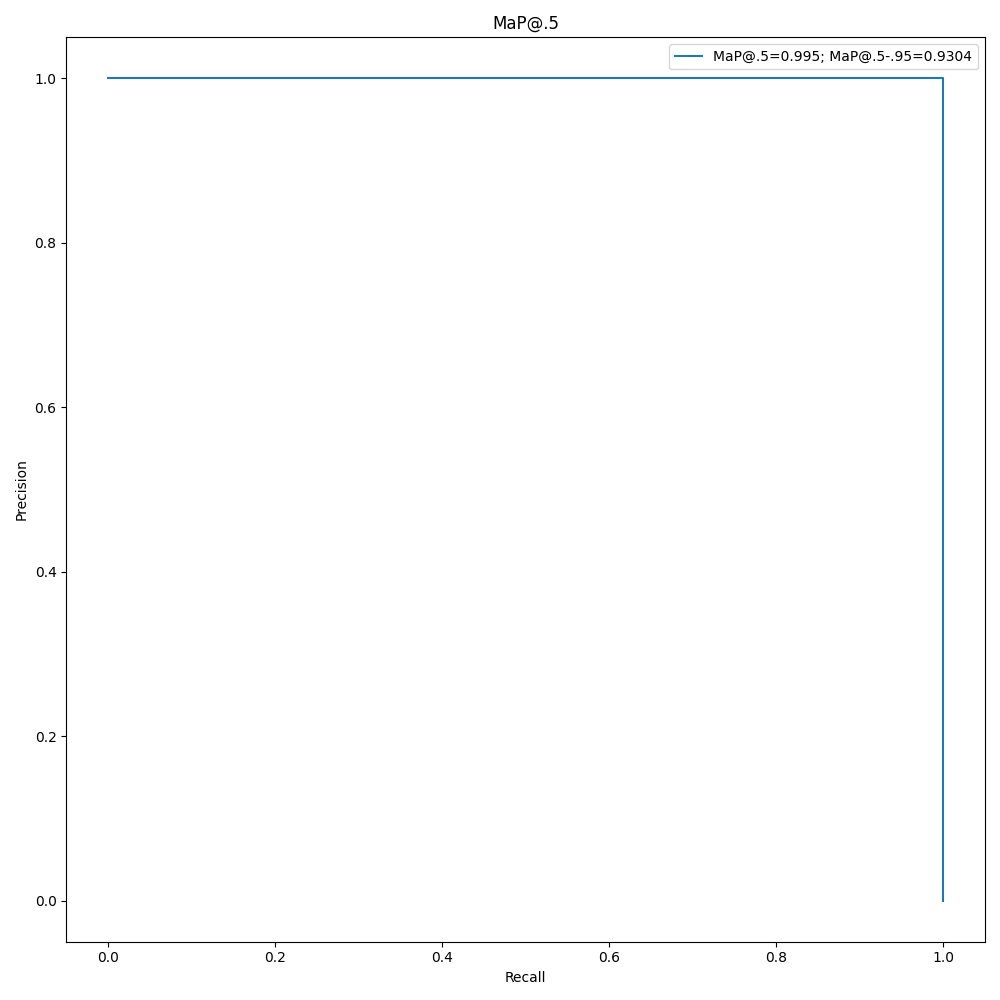
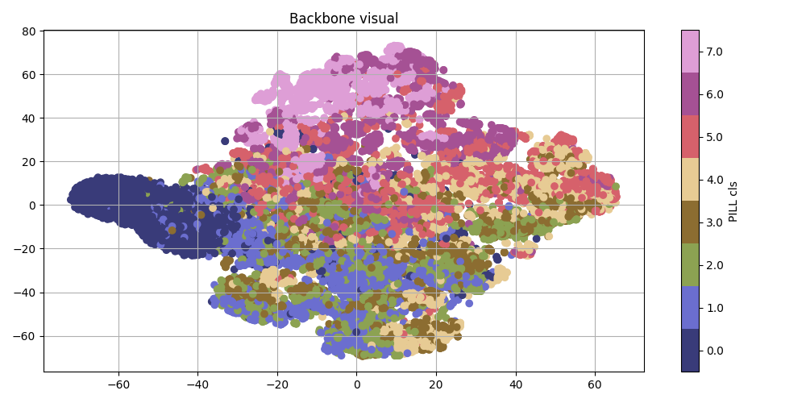

# Yolo-like detection model

Модель детекции на основе Yolo. В сравнении с моделями из обзора(Yolov3-7), EfficientDet, Detr, Faster-RCNN, CenterNet достигает схожих показателей:

- **MaP@.5**=0.995;
- **MaP@.5-.95**=0.9304;
- Вес модели 10Mb.

## Настройка окружения

Для создания докер-образа:
```bash
$ docker build . -t detection_trainer
$ docker run --gpus all -it -v <OUTPUT_DIR>:/usr/src/output --rm detection_trainer
```

### Обучение
Затем для запуска скрипта обучения:

```bash
$ python3 train.py <FLAGS>
```

Флаги:
- `--backbone <PATH TO PRETRAINED BACKBONE>`;
- `--epochs <NUMBER OF DETECTION TRAINING EPOCHS>`;
- `--back_epochs <NUMBER OF BACKBONE TRAINING EPOCHS>`(только если задан флаг `--backbone None`);
- `--description <PATH TO CSV WITH MATCHES>`:
    - Предполагаемый csv-файл должен выглядеть следующим образом(**Должны существовать директории с изображениями из следующей таблицы - в репозитории не предлагается эти директории и файл разметки**):

    |name|img|seg|
    |----|---|---|
    |\<NUMBER OF PETRI DISH>|\<PATH TO ORIGINAL IMAGE>|\<PATH TO SEGMENTATION DESCRIPTION>|
- `--train_path <TRAINING DIR PATH>`:
    - Директория с обучающей выборкой:
        - `images` с изображениями (1.jpg, 2.jpg, ...);
        - `labels` с Yolo-разметкой (1.txt, 2.txt, ...) - нормализованные координаты(от 0 до 1);
- `--val_path <VALIDATION DIR PATH>`:
    - Такая же, но для валидации(**Данные две директории не предлагаются в репозитории**);
- `--freeze <True/False>` - заморозка бэкбона в ходе обучения детектора;
- `--lr_backbone <BACKBONE LEARNING RATE>` - скорость обучения бэкбона в ходе обучения детекции;
- `--cos_scheduler <True/False>` - lr_scheduler косинусный или ReduceLROnPlateau.

В итоге **создастся** директория `detection_exp<№>`, где сохраняются:
- Лучшая модель детекции(лучшая с точки зрения метрики MaP@.5-.95) в формате .pth;
- Последняя модель детекции(результат после последней эпохи) в формате .pth;
- История валидационных показателей iou в формате .npy(число эпох $\times$ число элементов в валидационной выборке);
- Визуализация метрики с Precision, Recall с подписью лучших показателей модели;
- Прогресс изменения метрики MaP@.5 с ростом числа эпох;
- Прогресс изменения метрики MaP@.5-.95 с ростом числа эпох;
- Сохраненные веса бэкбона лучшей модели детекции(из п.1);
- Сохраненные веса бэкбона последней модели детекции(из п.2);
- Визуализация кластеризации данных лучшего бэкбона(кластеризация используется для визуализации обучаемости извлекателя признаков);
- Визуализация кластеризации данных последнего бэкбона.

Для воссоздания экспериментов можно выполнить скрипты `experiments_pretrained.sh`, `experiments_without_pretrained.sh`.

### Инференс

```bash
$ python3 infer.py <FLAGS>
```
Флаги:
- `--weight_path <PATH TO PRETRAINED DETECTION MODEL WEIGHTS>`;
- `--description <PATH TO CSV WITH MATCHES>`(как в обучении).

В итоге создается директория `inference_input<№>`, где хранятся исходные изображения.

Также создается директория `inference_pred<№>`, где хранятся результат работы модели на изображениях.

### Сохранение моделей

```bash
$ python3 export.py <FLAGS>
```
Флаги:
- `--onnx <False/True>` - сохранить модель в .pt или в .onnx;
- `--weight_path <PATH TO PRETRAINED DETECTION MODEL WEIGHTS>`;
- `--save_path <PATH TO SAVING DIRECTORY>` - путь до директории, где сохранится экспортированная модель `<PATH TO SAVING DIRECTORY>/Detector.pt` или `<PATH TO SAVING DIRECTORY>/Detector.onnx`

### Точность модели



